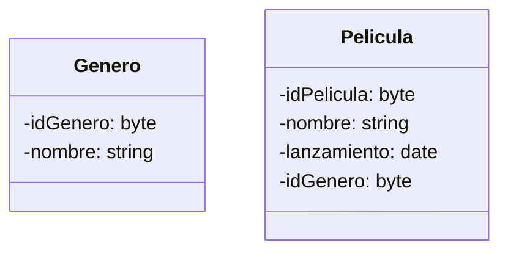

## Diagrama de Clases

```mermaid
classDiagram
    class Genero{
        -idGenero: byte
        -nombre: string
    }
    class Pelicula{
        -idPelicula: byte
        -nombre: string
        -lanzamiento: date
        -idGenero: byte
    }
```
