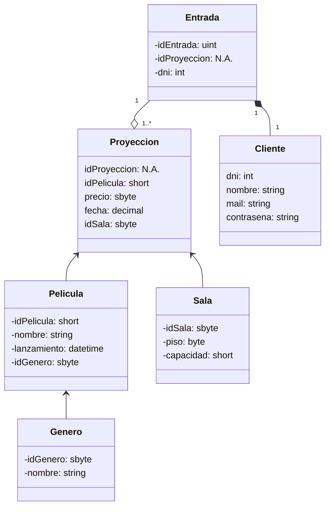

## Diagrama de Clases

```mermaid
classDiagram
Pelicula <-- Genero
Proyeccion <-- Sala
Proyeccion <-- Pelicula
Entrada "1"*--"1"Cliente
Entrada "1"--o"1..*" Proyeccion
    class Genero{
        -idGenero: sbyte
        -nombre: string
    }
    class Pelicula{
        -idPelicula: short
        -nombre: string
        -lanzamiento: datetime
        -idGenero: sbyte
    }
    class Sala{
        -idSala: sbyte
        -piso: byte
        -capacidad: short
    }
    class Proyeccion{
        idProyeccion: N.A.
        idPelicula: short
        precio: sbyte
        fecha: decimal
        idSala: sbyte
    }
    class Cliente{
        dni: int
        nombre: string
        mail: string
        contrasena: string
    }
    class Entrada{
        -idEntrada: uint
        -idProyeccion: N.A.
        -dni: int
    }
```
